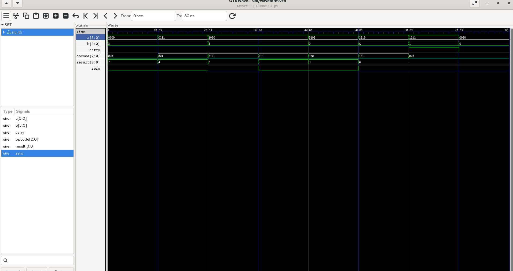
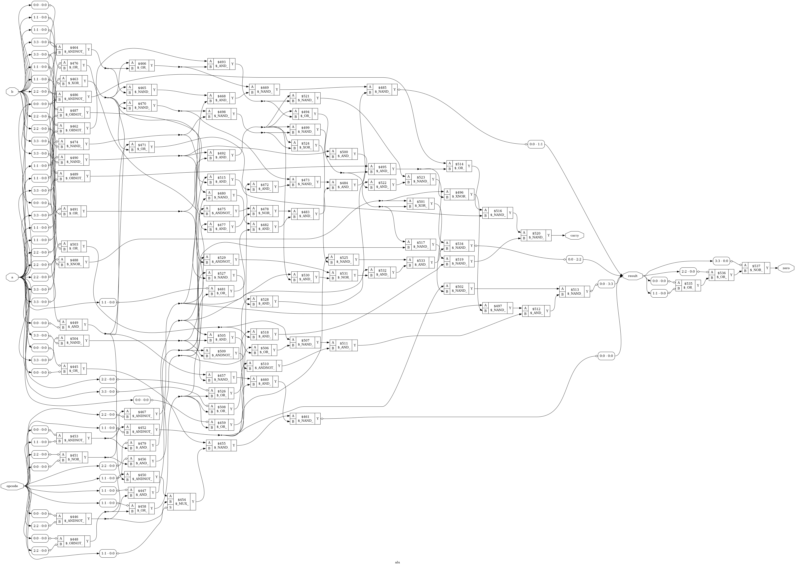

# 4-bit ALU with Functional Verification

A fully verified 4-bit Arithmetic Logic Unit (ALU) designed in Verilog, with a self-checking testbench featuring directed tests and constrained random stimulus.

---

## Features

- Supports 6 operations: ADD, SUB, AND, OR, NOT, XOR
- Output flags: Carry Out, Zero Flag, Overflow
- Self-checking testbench with pass/fail reporting
- Random verification with 500 auto-checked vectors
- Gate-level synthesis using Yosys
- Waveform analysis in GTKWave

---

## Project Structure

```
4bit-alu-verification/
├── rtl/
│   └── alu.v              # ALU RTL design
├── tb/
│   └── alu_tb.v           # Verilog testbench
├── sim/
│   └── waveform.vcd       # GTKWave dump
├── synth/
│   └── synth.ys           # Yosys synthesis script
├── docs/
│   └── waveforms/         # GTKWave screenshots and schematic
└── README.md
```

---

## Operation Encoding

| Opcode | Operation | Description         |
|--------|-----------|---------------------|
| 3'b000 | ADD       | A + B               |
| 3'b001 | SUB       | A - B               |
| 3'b010 | AND       | A & B               |
| 3'b011 | OR        | A \| B              |
| 3'b100 | NOT       | ~A                  |
| 3'b101 | XOR       | A ^ B               |

---

## Tools Used

| Tool             | Purpose                        |
|------------------|-------------------------------|
| Verilog          | RTL Design & Testbench        |
| Verilator        | Simulation                    |
| GTKWave          | Waveform Viewer               |
| Yosys            | Logic Synthesis               |

---

## How to Run

### Simulate with Verilator

```bash
verilator --binary --trace \
  rtl/alu.v tb/alu_tb.v \
  --top-module alu_tb \
  -o /home/srithar/4bit-alu-verification/sim/alu_sim

./sim/alu_sim
```

### View Waveforms

```bash
gtkwave sim/waveform.vcd
```

### Synthesize with Yosys

```bash
yosys synth/synth.ys
```

---

## Verification Plan

- **Directed tests** — all 6 opcodes with known input/output pairs
- **Edge cases** — A=0, B=0, A=15, B=15, overflow, underflow
- **Random tests** — 500 random vectors with auto-checking
- **Self-checking** — reference model computes expected result and compares with DUT output

---

## Sample Waveform



---

## Gate-level Schematic



---

## Results

| Metric                  | Result                        |
|-------------------------|-------------------------------|
| Directed tests          | ✅ 21 / 21 Passing            |
| Random tests            | ✅ 500 / 500 Passing          |
| Total tests             | ✅ 521 / 521 Passing          |
| Synthesis               | ✅ 93 gates, 0 problems       |
| Gate types              | AND, NAND, OR, NOR, XOR, MUX  |

---

## What I Learned

- RTL design using Verilog `case` statements
- Writing self-checking testbenches in Verilog
- Random verification using `$random` and `repeat` loops
- Reference model approach for auto-checking random tests
- 2's complement arithmetic — overflow and underflow behavior
- Gate-level synthesis flow using Yosys
- Debugging RTL bugs using Verilator strict linting
- Waveform analysis with GTKWave

---

## Academic Context

**Course:** BE.EE (VLSI Design and Technology)
**Institution:** Anna University Regional Campus Coimbatore
**Tools:** Open-source EDA (Yosys, Verilator, GTKWave)

---

## License

MIT License — feel free to fork and build on this!
